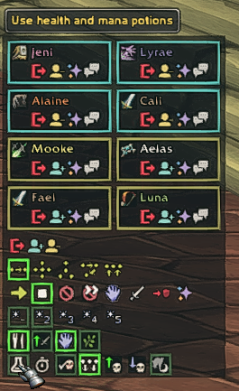
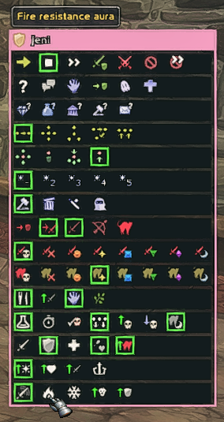

# CMaNGOS PlayerBot Addon - Classic

PlayerBot / MangosBot addon for **CMaNGOS Classic (WoW 1.12.1)**.

This repository contains the MangosBot addon for CMaNGOS PlayerBots, organized into separate branches for each supported expansion.

## Expansion Branches

Use the branch selector at the top of the repository to select the correct version:

- `classic` - World of Warcraft 1.12.1
- `tbc` - The Burning Crusade 2.4.3
- `wotlk` - Wrath of the Lich King 3.3.5a

## Installation

Place the addon files into:

`World of Warcraft\Interface\AddOns\Mangosbot`

The final structure should look like:

`Interface\AddOns\Mangosbot\Mangosbot.toc`

Restart the client or reload the UI after installation.

## Bot Roster

Use the `/bot` command in WoW to open the Bot Roster window.

Use the **Login** buttons on the appropriate bot window to bring bots online.

## Bot Controls

Select a bot to open the Bot Controls window. The interface provides buttons for commonly used PlayerBot actions.

## Additional Documentation

Additional documentation included with the addon:

- `CMANGOS-BOT-ENHANCED-README.txt`
- `CMANGOS-BOT-MANAGER-README.txt`
- `MANTECH-README.txt`

## Credits

The original MangosBot / PlayerBot addon and PlayerBot system originate from the CMaNGOS PlayerBots project and its contributors.

This repository is provided as a convenient location for accessing the addon versions for Classic, TBC, and WotLK.

This repository is not the official CMaNGOS repository.
